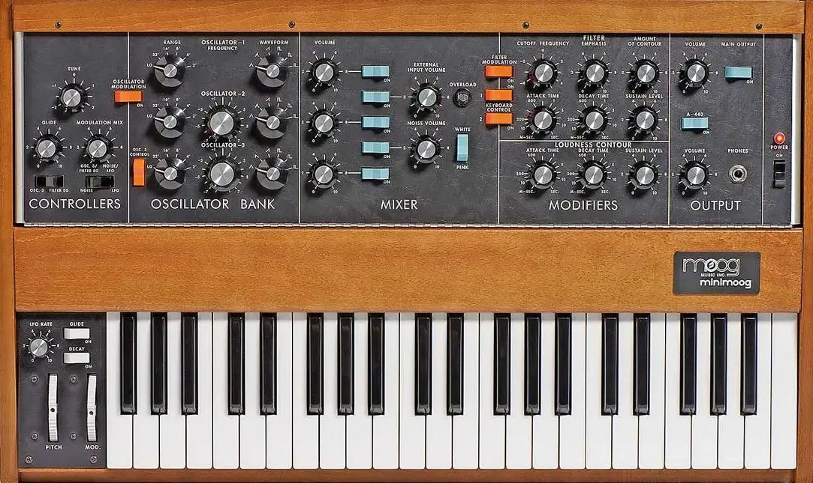
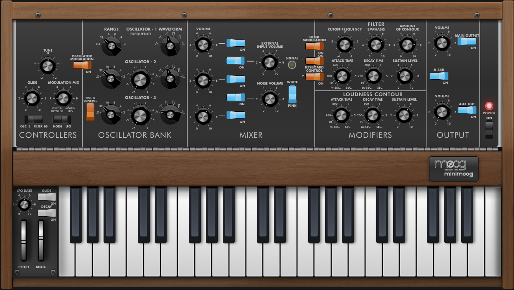

# Minimoog Model D Emulator

<p align="center">
  <br/>
  <em>Original Minimoog Model D (hardware)</em>
</p>

<p align="center">
  <br/>
  <em>Web-based Minimoog Model D Emulator (this project)</em>
</p>

A web-based emulation of the classic Minimoog Model D analog synthesizer, leveraging the Web Audio API for authentic sound synthesis and performance.

[](https://nodejs.org/)
[](https://reactjs.org/)
[](https://www.typescriptlang.org/)
[](https://vitest.dev/)
[](LICENSE)

---

## Table of Contents

- [Demo](#demo)
- [Overview](#overview)
- [Features](#features)
- [Quick Start](#quick-start)
- [Development](#development)
- [Project Structure](#project-structure)
- [Architecture](#architecture)
- [Testing](#testing)
- [URL State Persistence](#url-state-persistence)
- [Troubleshooting](#troubleshooting)
- [Contributing](#contributing)
- [Resources](#resources)
- [References](#references)
- [License](#license)

---

## Demo

Experience the Minimoog Model D emulator in your browser:

1. **Live Demo**: [Coming Soon]
2. **Local Development**: Follow the [Quick Start](#quick-start) guide below

### Key Features Demo

- **Three Oscillators**: Mix sawtooth, triangle, square, and pulse waves
- **4-Pole Ladder Filter**: Authentic Minimoog ladder filter with resonance and key tracking
- **Dual Envelopes**: Filter and loudness contours with authentic curves
- **MIDI Support**: Connect your MIDI keyboard for real-time control
- **Preset System**: Explore classic Minimoog sounds
- **URL Sharing**: Save and share your configurations

---

## Overview

This project recreates the iconic Minimoog Model D synthesizer in the browser using modern web technologies. It provides an authentic recreation of the original instrument's sound and interface, making the legendary synthesizer accessible to anyone with a web browser.

- **Authentic Sound**: Faithful recreation of the synthesizer's oscillator characteristics and filter behavior
- **Real-time Performance**: Low-latency audio processing for live performance
- **Responsive Design**: Works seamlessly on desktop and mobile devices
- **Modern Web Standards**: Built with React 19, TypeScript, and Web Audio API
- **Open Source**: Complete source code available for learning and modification

---

## Features

### Core Synthesis

- **Three-Oscillator Architecture**: Classic waveforms (sawtooth, triangle, square, reverse sawtooth, pulse)
- **Authentic Mixer**: Individual volume controls for oscillators, noise, and external input
- **4-Pole Ladder Filter**: Authentic Minimoog ladder filter with resonance and key tracking using Web Audio API
- **Dual Envelope Generators**: Filter and loudness contours with authentic response curves

### Modulation & Control

- **Modulation Sources**: LFO, noise, oscillator 3, and filter envelope
- **MIDI Support**: Connect your MIDI keyboard for real-time control
- **Virtual Keyboard**: On-screen keyboard with mouse and touch support
- **Performance Controls**: Glide, pitch bend, and modulation wheel

### User Experience

- **Preset System**: Curated collection of classic Minimoog sounds
- **URL State Persistence**: Save and share your current settings via URL parameters
- **Responsive Design**: Works on desktop and mobile devices
- **Logarithmic Controls**: Natural-feeling frequency and filter controls
- **Tuner Integration**: Built-in A-440 tone generator
- **Signal Indicator**: Visual indicator of incoming signal
- **Aux Output**: Secondary audio output for external routing

---

## Quick Start

### Prerequisites

- **Node.js**: Version 18.0.0 or higher
- **npm** or **yarn**: Package manager
- **Modern Browser**: Chrome, Firefox, Safari, or Edge with Web Audio API support

### Installation

```bash
# Clone the repository
git clone "https://github.com/stevebarakat/minimoog"
cd minimoog

# Install dependencies
npm install

# Start development server
npm run dev
```

The application will be available at `http://localhost:5173`

### First Steps

1. **Power On**: Click the power button to initialize the synthesizer
2. **Try a Preset**: Select a preset from the dropdown menu
3. **Play the Keyboard**: Use your computer keyboard or connect a MIDI device
4. **Experiment**: Adjust oscillators, filter, and envelopes to create your own sounds

---

## Development

### Development Scripts

```bash
npm run dev          # Start development server with hot reload
npm run build        # Build for production
npm run preview      # Preview production build locally
npm run test         # Run tests with Vitest
npm run test:ui      # Run tests with interactive UI
npm run test:coverage # Run tests with coverage report
npm run lint         # Run ESLint for code quality
npm run lint:css     # Run Stylelint and auto-fix issues
npm run lint:css:check # Check CSS without fixing
npm run analyze:css  # Analyze CSS structure and organization
```

### Key Dependencies

#### Core Technologies

- **React 19.1.0**: Modern React with concurrent features
- **TypeScript 5.5.3**: Type-safe development
- **Vite 6.2.1**: Fast build tool and dev server
- **Zustand 5.0.4**: Lightweight state management

#### Audio & Music

- **Web Audio API**: Native browser audio processing with custom worklets
- **Custom Audio Worklets**: Specialized processors for noise generation and modulation
- **Periodic Wave Synthesis**: Custom waveform generation for authentic sounds

#### UI & Styling

- **CSS Modules**: Scoped styling with camelCase class names
- **PostCSS**: Advanced CSS processing
- **Lucide React**: Modern icon library
- **Radix UI**: Accessible UI primitives

#### Testing & Quality

- **Vitest 3.1.4**: Fast unit testing framework
- **Testing Library**: React component testing
- **ESLint**: Code linting and formatting
- **Stylelint**: CSS quality assurance

---

## Project Structure

```
src/
  components/               # React UI components organized by feature
    OscillatorBank/         # Three-oscillator bank with modulation
    Mixer/                  # Audio mixer with individual controls
    Filter/                 # 4-pole ladder filter and envelope controls
    Envelopes/              # Filter and loudness envelope controls
    Controllers/            # Modulation and performance controls
    Keyboard/               # Virtual keyboard with MIDI support
    Knob/                   # Reusable knob component with linear/log scaling
    RockerSwitch/           # Authentic rocker switch component
    PresetsDropdown/        # Preset selection with URL sharing
    Output/                 # Main output and headphone controls
    Synth/                  # Main synthesizer container
    Tuner/                  # Built-in tuner for pitch calibration
    OverloadIndicator/      # Visual signal clipping indicators
    ExternalInput/          # External audio input controls
    ModulationWheel/        # Modulation wheel component
    PitchBender/            # Pitch bend controls
    Glide/                  # Glide/portamento controls
    Noise/                  # Noise generator controls
    Modifiers/              # Audio modification controls
    ModulationMix/          # Modulation mixing controls
    LfoRate/                # LFO rate controls
    LfoWaveformSwitch/      # LFO waveform selection
    DecaySwitch/            # Decay switch controls
    PowerButton/            # Power on/off controls
    VintageLED/             # Vintage-style LED indicators
    Title/                  # Component title displays
    Section/                # Section container components
    Row/                    # Row layout components
    Column/                 # Column layout components
    Line/                   # Line separator components
    Spacer/                 # Spacing components
    Hinge/                  # Hinge component for folding panels
    Side/                   # Side panel components
    SidePanel/              # Side panel container
    Logo/                   # Minimoog logo component
    Tune/                   # Tuning controls
    Wheel/                  # Wheel component for various controls
  hooks/                    # Custom React hooks
    useAudioContext.ts      # Web Audio API context management
    useURLSync.ts           # URL state synchronization
  store/                    # Zustand state management
    actions/                # State update actions
    state/                  # Initial state configuration
    types/                  # TypeScript type definitions
    synthStore.ts           # Main store implementation
  utils/                    # Utility functions
    presetConversion.ts     # Preset format conversion
    urlState.ts             # URL parameter handling
    noteToFrequency.ts      # Musical note utilities
    generatePresetURLs.ts   # Preset URL generation utilities
    cssPerformance.ts       # CSS performance optimization utilities
    helpers.tsx             # React helper components
  data/                     # Static data
    presets.ts              # Preset definitions
  styles/                   # Global CSS and design tokens
  test/                     # Test configuration
    setup.ts                # Vitest setup file

public/                     # Static assets
  images/                   # UI reference images
  delay-processor.js        # Web Audio worklet processors
  modulation-monitor-processor.js
  moog-zdf-processor.js
  overload-meter-processor.js
  pink-noise-processor.js
  white-noise-processor.js

resources/                  # Documentation and reference materials
  minimoog-description.txt  # Detailed synthesizer documentation
  minimoog-signalflow.png   # Signal flow diagram
  web-audio-performance.txt # Performance optimization notes
  ui/                       # UI reference images

docs/                       # Additional documentation
  aux-output.md            # Aux output feature documentation
  css-modules-best-practices.md # CSS Modules guidelines
```

---

## Architecture

### Design Principles

- **Colocation**: Related files (components, styles, tests, hooks, types) are placed together
- **Component Separation**: Each component has a single responsibility
- **Pure Functions**: Prefer immutable, side-effect-free functions
- **TypeScript First**: Comprehensive type safety throughout
- **CSS Modules**: Scoped styling with camelCase class names
- **Functional Programming**: Immutable state management with Zustand

### Audio Architecture

The synthesizer uses a modular audio architecture:

```
Oscillators → Mixer → 4-Pole Ladder Filter → Envelopes → Output
     ↓           ↓           ↓           ↓
  Modulation → LFO → Effects → Aux Output
```

### State Management

- **Zustand Store**: Centralized state management
- **URL Synchronization**: Automatic state persistence in URL
- **Immutable Updates**: All state changes are immutable
- **Type Safety**: Full TypeScript coverage for state

### Performance Optimizations

- **Web Audio Worklets**: Off-main-thread audio processing
- **CSS Modules**: Efficient styling with minimal overhead
- **React 19**: Concurrent features for better responsiveness
- **Lazy Loading**: Components loaded on demand
- **Memoization**: Strategic use of React.memo and useMemo

---

## Testing

The project uses **Vitest** for comprehensive testing:

### Test Features

- **Unit Tests**: Individual component and utility function testing
- **Integration Tests**: Component interaction testing
- **Test Coverage**: Comprehensive coverage reporting
- **UI Testing**: Visual test interface with `npm run test:ui`
- **JSDOM Environment**: Browser-like testing environment
- **Fast Execution**: Parallel test execution for quick feedback

### Running Tests

```bash
npm test                 # Run all tests
npm run test:ui         # Open interactive test UI
npm run test:coverage   # Generate coverage report
```

### Test Structure

Tests are co-located with their corresponding components and utilities:

```
src/
  components/
    Controllers/
      __tests__/
        Controllers.integration.test.tsx
    Output/
      __tests__/
        AuxOut.test.tsx
    Tuner/
      __tests__/
        Tuner.test.tsx
  utils/
    __tests__/
      presetConversion.test.ts
      presetToURL.test.ts
      urlState.test.ts
```

### Testing Best Practices

- **Component Testing**: Test component behavior, not implementation
- **Utility Testing**: Comprehensive coverage of pure functions
- **Integration Testing**: Test component interactions
- **Mocking**: Strategic use of mocks for external dependencies

---

## URL State Persistence

The Minimoog emulator supports saving and sharing your current settings via URL parameters:

### Features

- **Save Settings**: Click the "Copy URL" button next to the preset dropdown
- **Share Settings**: Share URLs to let others load your exact configuration
- **Bookmark Configurations**: Bookmark URLs to quickly return to specific sounds
- **Auto-Load**: Settings automatically load when visiting URLs with parameters

### Supported Parameters

All synth parameters are encoded in the URL, including:

- **Oscillators**: Waveforms, frequencies, and ranges
- **Mixer**: Levels and noise settings
- **Filter**: Cutoff, emphasis, and envelope settings
- **Modulation**: LFO, modulation mix settings
- **Performance**: Glide, keyboard control settings
- **Output**: Main and aux output settings

### URL Format

URLs are automatically generated and updated as you adjust controls, making it easy to share your exact sound configuration.

---

## Troubleshooting

### Common Issues

#### Audio Not Working

- **Check Browser Support**: Ensure your browser supports Web Audio API
- **Check Permissions**: Allow microphone access if prompted
- **Check Volume**: Ensure system and browser volume are not muted
- **Check Power**: Make sure the synthesizer is powered on

#### MIDI Not Responding

- **Check Connection**: Ensure MIDI device is properly connected
- **Check Permissions**: Allow MIDI access in browser settings
- **Check Device**: Verify MIDI device is recognized by your system
- **Check Channel**: Ensure MIDI device is on the correct channel

#### Performance Issues

- **Close Other Tabs**: Reduce browser resource usage
- **Update Browser**: Use the latest version of your browser
- **Check Extensions**: Disable audio-related browser extensions
- **Reduce Polyphony**: Limit the number of simultaneous notes

#### Build Issues

- **Clear Cache**: Run `npm run build --force`
- **Update Dependencies**: Run `npm update`
- **Check Node Version**: Ensure Node.js 18.0.0+ is installed
- **Reinstall Dependencies**: Delete `node_modules` and run `npm install`

### Getting Help

1. **Check Documentation**: Review the [Resources](#resources) section
2. **Search Issues**: Look for similar issues in the project repository
3. **Create Issue**: Report bugs with detailed information
4. **Community**: Join discussions in the project community

---

## Contributing

We welcome contributions to improve the Minimoog Model D emulator!

### How to Contribute

1. **Fork the Repository**: Create your own fork of the project
2. **Create a Branch**: Make changes in a feature branch
3. **Follow Guidelines**: Adhere to coding standards and practices
4. **Test Changes**: Ensure all tests pass
5. **Submit PR**: Create a pull request with clear description

### Development Guidelines

#### Code Style

- **TypeScript**: Use strict TypeScript with proper typing
- **ESLint**: Follow ESLint rules and formatting
- **CSS Modules**: Use CSS Modules with camelCase class names
- **Component Structure**: Follow established component patterns

#### Testing

- **Write Tests**: Add tests for new features
- **Maintain Coverage**: Keep test coverage high
- **Test Components**: Test component behavior and interactions
- **Test Utilities**: Test utility functions thoroughly

#### Documentation

- **Update README**: Keep documentation current
- **Add Comments**: Document complex logic
- **Update Types**: Keep TypeScript definitions current
- **Write Docs**: Add documentation for new features

### Areas for Contribution
- **Filter Quality**: Improve the quality of the 4-pole ladder filter
- **Performance**: Audio and rendering optimizations
- **Testing**: Improved test coverage and quality
- **Accessibility**: Improved accessibility features

---

## Resources

### Documentation

- **[Minimoog Description](resources/minimoog-description.txt)**: In-depth explanation of the synthesizer's architecture and controls
- **[Signal Flow Diagram](resources/minimoog-signalflow.png)**: Visual overview of the internal signal routing
- **[Web Audio Performance Notes](resources/web-audio-performance.txt)**: Best practices for Web Audio API optimization

### Development Guides

- **[Aux Output Documentation](docs/aux-output.md)**: Detailed guide to the aux output feature
- **[CSS Modules Best Practices](docs/css-modules-best-practices.md)**: Guidelines for CSS Modules usage

### External Resources

- **[Web Audio API Documentation](https://developer.mozilla.org/en-US/docs/Web/API/Web_Audio_API)**: Official MDN documentation
- **[React Documentation](https://react.dev/)**: Official React documentation
- **[TypeScript Handbook](https://www.typescriptlang.org/docs/)**: TypeScript language guide

---

## References

### Technical References

- [Web Audio API Performance and Debugging Notes](https://padenot.github.io/web-audio-perf/)
- [Minimoog Model D Manual](resources/minimoog-description.txt)
- [Web Audio API Documentation (MDN)](https://developer.mozilla.org/en-US/docs/Web/API/Web_Audio_API)

### Project Configuration

- [Project Preferences](dev-preferences.json): Development preferences and guidelines
- [Vite Configuration](vite.config.ts): Build and development configuration
- [TypeScript Configuration](tsconfig.json): TypeScript compiler settings

### Audio Synthesis

- [4-Pole Ladder Filter](https://en.wikipedia.org/wiki/Ladder_filter): Minimoog's iconic ladder filter implementation
- [Analog Synthesizer Architecture](https://en.wikipedia.org/wiki/Analog_synthesizer): Overview of analog synthesis
- [Web Audio API Worklets](https://developer.mozilla.org/en-US/docs/Web/API/AudioWorklet): Custom audio processing

---

## License

This project is licensed under the MIT License - see the [LICENSE](LICENSE) file for details.

### License Summary

The MIT License allows you to:

- Use the software for any purpose
- Modify the software
- Distribute the software
- Distribute modified versions
- Use it commercially

The only requirement is that the original license and copyright notice be included in all copies or substantial portions of the software.

---

_Built with ❤️ by S.Barakat_
